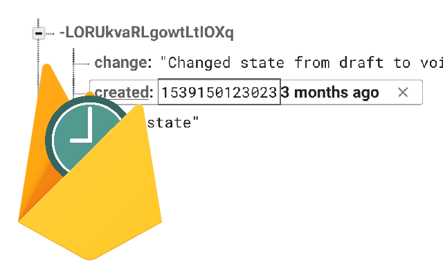

# FireTime

FireTime is a chrome extension that displays a moment.js relative time for timestamps when viewing data in the Firebase console.

I got sick of copy and pasting firebase time stamps into unix epoch time converts (after dividing the number by 1000). This extension solves that problem.

FireTime is in no way endorsed by Firebase, Google, or the Moment.js team. Use it at your own risk.
